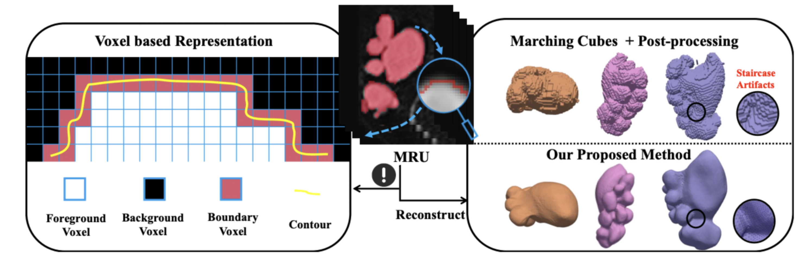
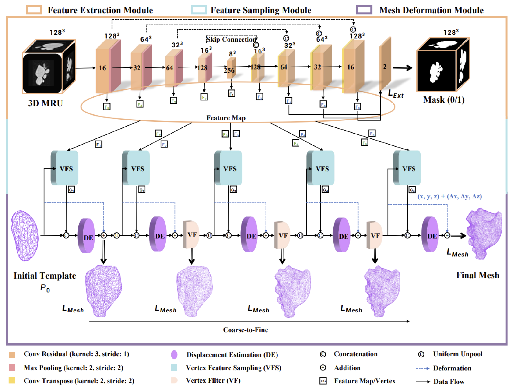
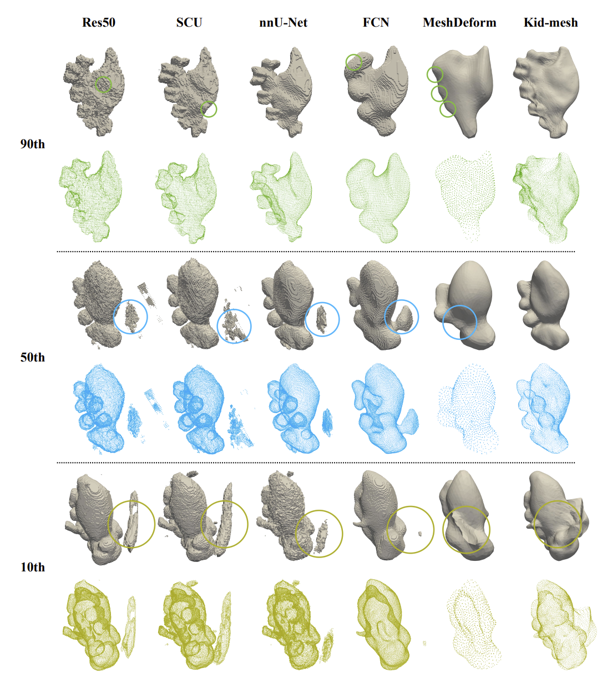

# 🧩 KidMesh: Computational Mesh Reconstruction for Pediatric Congenital Hydronephrosis Usingv Deep Neural Networks

<div align="center">

[](https://doi.org/10.1109/JBHI.2026.3679524)
[](https://www.python.org/)
[](https://pytorch.org/)
[](https://pytorch3d.org/)
[](#)

**Fast MRU-to-Mesh reconstruction for pediatric congenital hydronephrosis and urodynamic simulation.**

**🌟 If KidMesh is useful for your research, please consider giving this repository a star. 🌟**

[🚀 Quick Start](#-quick-start) •
[🧠 Method](#-method) •
[📊 Results](#-results) •
[📦 Data Preparation](#-data-preparation) •
[🔧 Training](#-training) •
[📝 Citation](#-citation)

</div>

---

## 📖 Overview

**KidMesh** is an end-to-end deep learning framework for reconstructing computational meshes of **pediatric congenital hydronephrosis (CH)** directly from **magnetic resonance urography (MRU)** scans.

Traditional clinical pipelines usually follow:

```text
MRU volume → voxel segmentation → Marching Cubes → smoothing/topology correction → CFD mesh
```

This segmentation-to-mesh workflow is often slow, sensitive to sparse slice sampling, and prone to staircase artifacts. **KidMesh** instead learns to deform a kidney-shaped template mesh into a patient-specific CH surface, producing smooth and topology-consistent meshes that can be used for downstream **computational fluid dynamics (CFD)** simulation.

---


### 🖼️ Visual Overview

<div align="center">
  
  <br>
  <em>KidMesh reconstructs patient-specific hydronephrosis meshes directly from MRU scans for downstream urodynamic simulation.</em>
</div>

## ✨ Highlights

- **End-to-end MRU-to-mesh reconstruction**  
  Generate patient-specific CH meshes directly from MRU scans without complex post-processing.

- **CFD-ready anatomical surfaces**  
  KidMesh is designed to produce smooth, watertight, and topology-consistent meshes for urodynamic analysis.

- **CNN + GCN explicit deformation**  
  3D convolutional features guide graph-based template deformation from coarse anatomical shape to fine local geometry.

- **Dynamic vertex upsampling**  
  Uniform unpooling and adaptive vertex filtering refine the mesh while maintaining geometric stability.

- **Weak supervision from pseudo-gold meshes**  
  Training does not require manual vertex-level mesh annotation. Pseudo-gold meshes are generated from CH masks and used as geometric supervision.
---

## 🧠 Method

KidMesh contains three core modules:

<div align="center">
  
  <br>
  <em>Overall architecture of KidMesh: 3D MRU feature extraction, vertex-wise feature sampling, and coarse-to-fine mesh deformation.</em>
</div>

### 1. Feature Extraction Module

The **Feature Extraction Module (FEM)** uses a 3D U-Net-like encoder–decoder to extract hierarchical MRU features. Segmentation supervision encourages the network to focus on hydronephrosis boundaries and boundary-sensitive anatomical structures.

### 2. Feature Sampling Module

The **Feature Sampling Module (FSM)** bridges voxel space and mesh space. It samples volumetric MRU features around each mesh vertex through grid sampling and learns vertex-wise feature descriptors for subsequent deformation.

### 3. Mesh Deformation Module

The **Mesh Deformation Module (MDM)** progressively deforms an initial kidney-shaped template mesh. Each deformation stage predicts vertex displacements with graph convolutional layers, while dynamic vertex upsampling improves local geometric detail.

---

## 📁 Repository Structure

The current codebase is organized around training, evaluation, data loading, and mesh deformation:

```text
KidMesh/
├── main.py                     # Training entry point
├── config.py                   # Experiment, data, model, and optimizer configuration
├── train.py                    # Training loop
├── evaluate.py                 # Evaluation, mesh export, and voxel export
├── requirements.txt            # Python dependencies
├── model/
│   └── kidmesh.py              # KidMesh network: FEM + FSM + MDM
├── data/
│   ├── KD.py                   # CH dataset support, preprocessing, evaluation metrics
│   └── data.py                 # Dataset item construction, augmentation, voxel-to-mesh tools
├── spheres/
│   └── kidney_left_162_N.obj   # Default kidney-shaped template mesh
└── utils/                      # Graph conv, feature sampling, rasterization, metrics, losses
```

---

## 🚀 Quick Start

### Prerequisites

- Linux or WSL environment recommended
- NVIDIA GPU with CUDA support
- Python 3.10+ or 3.11
- PyTorch + PyTorch3D
- Recommended GPU memory: 6 GB+ for the default 162-vertex template setting

### Installation

```bash
# Clone the repository
git clone https://github.com/manglu097/KidMesh.git
cd KidMesh

# Create environment
conda create -n kidmesh python=3.11 -y
conda activate kidmesh

# Install PyTorch for CUDA 11.8
pip install torch==2.0.0+cu118 --index-url https://download.pytorch.org/whl/cu118

# Install other dependencies
pip install -r requirements.txt
```

If PyTorch3D installation fails, install a wheel that matches your local CUDA and PyTorch versions. See the official PyTorch3D installation guide.

---

## 📦 Data Preparation

KidMesh expects paired MRU volumes and binary CH masks.

### Recommended raw data layout

```text
data/
└── dataset/
    ├── positions.json
    └── data_final/
        ├── data/               # MRU volumes, e.g., case_001.nii.gz
        └── seg/                # CH masks, same filenames as MRU volumes
```

Each MRU volume and its corresponding mask should share the same filename.

### Preprocess data

The preprocessing pipeline crops the CH region, resamples volumes, normalizes MRU intensities, and generates serialized training/testing files.

```bash
python - <<'PY'
from config import load_config

cfg = load_config(100)
cfg.data_obj.pre_process_dataset(cfg)
PY
```

After preprocessing, the dataset directory should contain:

```text
data/dataset/data_final/
├── final_data_training.pickle
├── final_data_testing.pickle
├── data.h5
├── data/
└── seg/
```

> Note: The clinical MRU dataset is not included in this repository due to privacy restrictions.

---

## 🔧 Training

Before training, edit the following fields if needed:

```python
# main.py
GPU_index = "0"
exp_id = 1

# config.py
cfg.save_path = "./data/result"
cfg.dataset_path = "./data/dataset/data_final"
cfg.output_shape = (128, 128, 128)
cfg.pad_shape = (128, 128, 128)
cfg.learning_rate = 1e-4
cfg.numb_of_itrs = xxxx
```

Start training:

```bash
python main.py
```

KidMesh uses Weights & Biases logging by default. If you do not want to use W&B, disable or remove the `wandb.init()` and `wandb.log()` calls in `main.py` and `train.py`.

### Resume training

Set `cfg.trial_id` in `config.py` to the trial you want to resume. The script will load:

```text
data/result/Experiment_<exp_id>/trial_<trial_id>/best_performance/model.pth
```

---

## 📊 Results

### Qualitative Reconstruction

<div align="center">
  
  <br>
  <em>Representative reconstruction results comparing MRU input, reference CH mask, and KidMesh-generated meshes.</em>
</div>

### Why not only segmentation?

Voxel-based segmentation methods can achieve strong Dice scores, but CFD simulation requires high-quality surface meshes. Directly applying Marching Cubes to sparse MRU segmentations may introduce staircase artifacts, holes, noisy surfaces, or topological failures. KidMesh focuses on generating smooth computational meshes rather than only maximizing voxel-level overlap.

---

## 🧪 Template Meshes

KidMesh starts from a kidney-shaped template mesh. The default implementation loads:

```text
spheres/kidney_left_162_N.obj
```

This template is normalized and then progressively deformed into the target CH shape. To use a different template resolution, update the template path in `model/kidmesh.py`.

---

## ⚠️ Notes

- This repository is intended for research use.
- Clinical MRU data are not included.
- The current public code focuses on training and evaluation-time mesh export.
- Standalone inference scripts and pretrained checkpoints can be added in future releases.
- Please verify mesh quality before using outputs in external CFD solvers.

---

## 📝 Citation

If you find KidMesh useful, please cite our paper:

```bibtex
@article{sun2026kidmesh,
  title={KidMesh: computational mesh reconstruction for pediatric congenital hydronephrosis using deep neural networks},
  author={Sun, Haoran and Zhu, Zhanpeng and Zhang, Anguo and Liu, Bo and Lin, Zhaohua and Huang, Liqin and Yang, Mingjing and Liu, Lei and Lin, Shan and Ding, Wangbin},
  journal={IEEE Journal of Biomedical and Health Informatics},
  year={2026},
  publisher={IEEE}
}
```

---

## 🙏 Acknowledgments

We thank the clinical collaborators and radiologists involved in MRU data collection and annotation. KidMesh also builds upon open-source tools including PyTorch, PyTorch3D, Trimesh, VTK, NiBabel, and scikit-image.

---

## 📞 Contact

For questions, suggestions, or collaboration:

- **GitHub Issues**: [https://github.com/manglu097/KidMesh/issues](https://github.com/manglu097/KidMesh/issues)
- **Email**: manglu3935@126.com

---

<div align="center">

**Made with ❤️ by the KidMesh Team**

[⬆ back to top](#-kidmesh-cfd-ready-mesh-reconstruction-for-pediatric-congenital-hydronephrosis)

</div>
